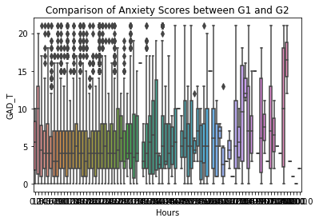
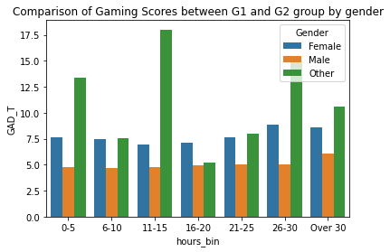
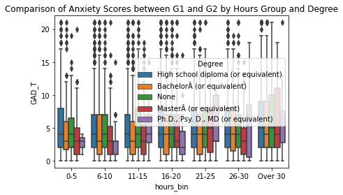

---
jupyter:
  colab:
  kernelspec:
    display_name: Python 3
    language: python
    name: python3
  language_info:
    codemirror_mode:
      name: ipython
      version: 3
    file_extension: .py
    mimetype: text/x-python
    name: python
    nbconvert_exporter: python
    pygments_lexer: ipython3
    version: 3.7.16
  nbformat: 4
  nbformat_minor: 0
  vscode:
    interpreter:
      hash: abf1f2b265e56c378ca529bfcad2d9d67235f4b9ac3e47ac46423784761daf85
---

<div class="cell markdown" id="9xZnRXM7x0Cv">

# CUHK-STAT1013: Practical Assignment Part 1: Sharing Your Idea and Data

</div>

<div class="cell markdown" id="9Fy05KAkyJI0">

## Online Gaming Anxiety Data Background

**Description**:

The dataset consists of survey responses collected from gamers
worldwide, aimed at understanding the relationship between online gaming
and anxiety, social phobia, and life satisfaction.

**Kaggle**:
<https://www.kaggle.com/datasets/divyansh22/online-gaming-anxiety-data>

**Sample size**: 14,250

**Feature documentation**:

| Feature         | Class      | Shape | Dtype   |
|:----------------|:-----------|:------|:--------|
| S. No.          | ClassLabel |       | int64   |
| Timestamp       | Tensor     |       | float32 |
| GAD1            | Tensor     |       | int64   |
| GAD2            | Tensor     |       | int64   |
| GAD3            | Tensor     |       | int64   |
| GAD4            | Tensor     |       | int64   |
| GAD5            | Tensor     |       | int64   |
| GAD6            | Tensor     |       | int64   |
| GAD7            | Tensor     |       | int64   |
| GADE            | ClassLabel |       | string  |
| SWL1            | Tensor     |       | int64   |
| SWL2            | Tensor     |       | int64   |
| SWL3            | Tensor     |       | int64   |
| SWL4            | Tensor     |       | int64   |
| SWL5            | Tensor     |       | int64   |
| Game            | ClassLabel |       | string  |
| Platform        | ClassLabel |       | string  |
| Hours           | Tensor     |       | int64   |
| earnings        | ClassLabel |       | string  |
| whyplay         | ClassLabel |       | string  |
| League          | ClassLabel |       | string  |
| highestleague   | ClassLabel |       | string  |
| streams         | Tensor     |       | int64   |
| SPIN1           | Tensor     |       | int64   |
| SPIN2           | Tensor     |       | int64   |
| SPIN3           | Tensor     |       | int64   |
| SPIN4           | Tensor     |       | int64   |
| SPIN5           | Tensor     |       | int64   |
| SPIN6           | Tensor     |       | int64   |
| SPIN7           | Tensor     |       | int64   |
| SPIN8           | Tensor     |       | int64   |
| SPIN9           | Tensor     |       | int64   |
| SPIN10          | Tensor     |       | int64   |
| SPIN11          | Tensor     |       | int64   |
| SPIN12          | Tensor     |       | int64   |
| SPIN13          | Tensor     |       | int64   |
| SPIN14          | Tensor     |       | int64   |
| SPIN15          | Tensor     |       | int64   |
| SPIN16          | Tensor     |       | int64   |
| SPIN17          | Tensor     |       | int64   |
| Narcissism      | Tensor     |       | int64   |
| Gender          | ClassLabel |       | string  |
| Age             | Tensor     |       | int64   |
| Work            | ClassLabel |       | string  |
| Degree          | ClassLabel |       | string  |
| Birthplace      | ClassLabel |       | string  |
| Residence       | ClassLabel |       | string  |
| Reference       | ClassLabel |       | string  |
| Playstyle       | ClassLabel |       | string  |
| accept          | ClassLabel |       | string  |
| GAD_T           | Tensor     |       | int64   |
| SWL_T           | Tensor     |       | int64   |
| SPIN_T          | Tensor     |       | int64   |
| Residence_ISO3  | ClassLabel |       | string  |
| Birthplace_ISO3 | ClassLabel |       | string  |

</div>

<div class="cell code" execution_count="1" id="WAOGtE2E0rqr">

``` python
```

</div>

<div class="cell markdown" id="k85zO7zxys4H">

## Hypothesis

-   Tell us what your idea is and why you have chosen to pursue this
    idea.
    -   We are interested in *Does the amount of time spent playing
        online games have an impact on gamers' anxiety levels?*
-   What two groups you are comparing:
    -   **G1**: Gamers who spend less than 20 hours per week on online
        gaming.; **G2**: Gamers who spend more than 20 hours per week on
        online gaming.
-   What you will be measuring (i.e., what your response variable will
    be)
    -   `GAD_T`
-   Is your response variable quantitative rather than categorical?
    -   `GAD_T` is a quantitative variable.
-   Make a prediction about what kind of difference you expect to see
    between your samples and WHY.
    -   We expect to see that G2 \> G1 since excessive online gaming has
        been linked to increased levels of anxiety. [Role of excessive
        use of internet games on anxiety and depression among college
        students](https://www.researchgate.net/publication/332530156_Role_of_excessive_use_of_internet_games_on_anxiety_and_depression_among_college_students),
        [The Relationship Between Video Games and
        Anxiety](https://www.healthyplace.com/addictions/gaming-disorder/the-relationship-between-video-games-and-anxiety)
-   Talk about how you will gather your data
    -   From Kaggle link:
        <https://www.kaggle.com/datasets/divyansh22/online-gaming-anxiety-data>,
        uploaded to aws s3:
        <https://d317ximd301i28.cloudfront.net/GamingStudy_data.csv>
-   If you had unlimited resources (time, money, staff, etc.) how would
    you collect your data?
    -   \(i\) Expand the sample size to be more representative of the
        global gaming population; (ii) collect data on other factors
        that may affect anxiety levels, such as age, gender, and game
        genre preference.

</div>

<div class="cell markdown" id="3GOdPWT03PQB">

## Prepare your dataset

</div>

<div class="cell code" execution_count="2"
colab="{&quot;base_uri&quot;:&quot;https://localhost:8080/&quot;,&quot;height&quot;:236}"
id="mUxJb4hxvpHQ" outputId="df176222-b84f-46d8-cdfe-a73f8c25e5eb">

``` python
## load dataset from github

import pandas as pd

df = pd.read_csv('https://d317ximd301i28.cloudfront.net/GamingStudy_data.csv', encoding = 'ISO-8859-1')
df.head(5)
```

<div class="output execute_result" execution_count="2">

       S. No.    Timestamp  GAD1  GAD2  GAD3  GAD4  GAD5  GAD6  GAD7  \
    0   13535  42055.25849     0     0     0     0     0     0     0   
    1   13104  42055.13505     3     0     3     1     0     1     0   
    2   11981  42054.99729     1     1     1     1     0     0     0   
    3   10668  42054.93297     0     0     0     0     0     0     0   
    4    9295  42054.86336     1     0     0     0     1     0     0   

                       GADE  ...    Birthplace  Residence  Reference  \
    0  Not difficult at all  ...  Saudi Arabia   Pakistan     Reddit   
    1    Somewhat difficult  ...           USA        USA     Reddit   
    2    Somewhat difficult  ...        France     France     Reddit   
    3  Not difficult at all  ...       Tunisia     France     Reddit   
    4  Not difficult at all  ...       Germany    Germany     Reddit   

                                           Playstyle  accept GAD_T SWL_T  SPIN_T  \
    0          Multiplayer - online - with strangers  Accept     0    16     9.0   
    1          Multiplayer - online - with strangers  Accept     8    25    11.0   
    2  Multiplayer - online - with real life friends  Accept     4    34     NaN   
    3                                   Singleplayer     NaN     0    28     2.0   
    4      Duo Queue with one good friend, else solo  Accept     2    28    21.0   

      Residence_ISO3 Birthplace_ISO3  
    0            PAK             SAU  
    1            USA             USA  
    2            FRA             FRA  
    3            FRA             TUN  
    4            DEU             DEU  

    [5 rows x 55 columns]

</div>

</div>

<div class="cell markdown" id="55xAIxVa3hpQ">

-   Tell us what groups you want to compare in the dataset
    -   **G1** (anxiety score \| hours_played ≤ 20) vs. **G2** (anxiety
        score \| hours_played \> 20)

</div>

<div class="cell markdown" id="13PdL3ht3902">

-   Print first 5 records of each group, respectively.

</div>

<div class="cell code" execution_count="3"
colab="{&quot;base_uri&quot;:&quot;https://localhost:8080/&quot;,&quot;height&quot;:236}"
id="UNL0WXav3hLj" outputId="e92005e6-4160-41b1-fb88-02976316a079">

``` python
## First 5 records of G1
(df[df['Hours'] <= 20]).head(5)
```

<div class="output execute_result" execution_count="3">

       S. No.    Timestamp  GAD1  GAD2  GAD3  GAD4  GAD5  GAD6  GAD7  \
    0   13535  42055.25849     0     0     0     0     0     0     0   
    1   13104  42055.13505     3     0     3     1     0     1     0   
    2   11981  42054.99729     1     1     1     1     0     0     0   
    3   10668  42054.93297     0     0     0     0     0     0     0   
    4    9295  42054.86336     1     0     0     0     1     0     0   

                       GADE  ...    Birthplace  Residence  Reference  \
    0  Not difficult at all  ...  Saudi Arabia   Pakistan     Reddit   
    1    Somewhat difficult  ...           USA        USA     Reddit   
    2    Somewhat difficult  ...        France     France     Reddit   
    3  Not difficult at all  ...       Tunisia     France     Reddit   
    4  Not difficult at all  ...       Germany    Germany     Reddit   

                                           Playstyle  accept GAD_T SWL_T  SPIN_T  \
    0          Multiplayer - online - with strangers  Accept     0    16     9.0   
    1          Multiplayer - online - with strangers  Accept     8    25    11.0   
    2  Multiplayer - online - with real life friends  Accept     4    34     NaN   
    3                                   Singleplayer     NaN     0    28     2.0   
    4      Duo Queue with one good friend, else solo  Accept     2    28    21.0   

      Residence_ISO3 Birthplace_ISO3  
    0            PAK             SAU  
    1            USA             USA  
    2            FRA             FRA  
    3            FRA             TUN  
    4            DEU             DEU  

    [5 rows x 55 columns]

</div>

</div>

<div class="cell code" execution_count="4"
colab="{&quot;base_uri&quot;:&quot;https://localhost:8080/&quot;,&quot;height&quot;:236}"
id="dhe52HVB4T1O" outputId="522e18c7-a669-4ede-8b3a-e8cca2c95445">

``` python
## First 5 records of G2
(df[df['Hours'] > 20]).head(5)
```

<div class="output execute_result" execution_count="4">

          S. No.    Timestamp  GAD1  GAD2  GAD3  GAD4  GAD5  GAD6  GAD7  \
    8328   14231  42056.37289     2     1     3     0     3     1     1   
    8329   14210  42055.82860     2     0     2     0     0     1     0   
    8330   14207  42055.81104     0     0     0     0     0     0     0   
    8331   14186  42055.72817     2     2     3     1     1     2     3   
    8332   14177  42055.70912     0     1     1     0     0     0     1   

                          GADE  ...  Birthplace  Residence  Reference  \
    8328    Somewhat difficult  ...         USA        USA      Other   
    8329  Not difficult at all  ...         USA        USA     Reddit   
    8330    Somewhat difficult  ...      Canada     Canada     Reddit   
    8331        Very difficult  ...         USA        USA     Reddit   
    8332  Not difficult at all  ...   Australia  Australia     Reddit   

                                              Playstyle  accept GAD_T SWL_T  \
    8328  Multiplayer - online - with real life friends  Accept    11    28   
    8329  Multiplayer - online - with real life friends  Accept     5    30   
    8330  Multiplayer - online - with real life friends  Accept     0    30   
    8331          Multiplayer - online - with strangers  Accept    14    12   
    8332  Multiplayer - online - with real life friends  Accept     3    25   

          SPIN_T Residence_ISO3 Birthplace_ISO3  
    8328    13.0            USA             USA  
    8329    19.0            USA             USA  
    8330    29.0            CAN             CAN  
    8331    52.0            USA             USA  
    8332    35.0            AUS             AUS  

    [5 rows x 55 columns]

</div>

</div>

<div class="cell code" execution_count="5" id="zEgfWXaKGvNC">

``` python
## Any other data description and visualization you want to add.

## Open question, be flexible and no example can be provided.
```

</div>

<div class="cell markdown" id="FF0lSyRI1skl">

## Compare anxiety scores between G1 and G2

</div>

<div class="cell code" execution_count="6"
colab="{&quot;base_uri&quot;:&quot;https://localhost:8080/&quot;,&quot;height&quot;:312}"
id="eb6q8aH93QZo" outputId="80e46fbf-55c2-4cb9-800d-329836229093">

``` python
import seaborn as sns

G1 = df[df['Hours'] <= 20]
G2 = df[df['Hours'] > 20]

sns.boxplot(x='Hours', y='GAD_T', data=df).set_title('Comparison of Anxiety Scores between G1 and G2')
```

<div class="output execute_result" execution_count="6">

    Text(0.5, 1.0, 'Comparison of Anxiety Scores between G1 and G2')

</div>

<div class="output display_data">



</div>

</div>

<div class="cell markdown" id="VUrA6T2N2Izn">

## Compare anxiety scores between G1 and G2 group by gender

</div>

<div class="cell code" execution_count="7"
colab="{&quot;base_uri&quot;:&quot;https://localhost:8080/&quot;,&quot;height&quot;:313}"
id="Hs3bbi7U3rRG" outputId="4087874e-34c1-449d-ec8b-ea5409ada0ed">

``` python
bins = [0, 5, 10, 15, 20, 25, 30, float('inf')]
labels = ['0-5', '6-10', '11-15', '16-20', '21-25', '26-30', 'Over 30']

df['hours_bin'] = pd.cut(df['Hours'], bins=bins, labels=labels)

grouped = df.groupby(['hours_bin', 'Gender'], as_index=False)['GAD_T'].mean()

sns.barplot(x='hours_bin', y='GAD_T', hue='Gender', data=grouped).set_title('Comparison of Gaming Scores between G1 and G2 group by gender')
```

<div class="output execute_result" execution_count="7">

    Text(0.5, 1.0, 'Comparison of Gaming Scores between G1 and G2 group by gender')

</div>

<div class="output display_data">



</div>

</div>

<div class="cell markdown" id="v91Sxxpn4f7z">

## Comparison of Anxiety Scores between G1 and G2 by Hours Group and Degree

</div>

<div class="cell code" execution_count="9"
colab="{&quot;base_uri&quot;:&quot;https://localhost:8080/&quot;,&quot;height&quot;:313}"
id="LPkgJteo2yG0" outputId="5923f199-6ac2-4df1-ca53-d295c5795b49">

``` python
sns.boxplot(x='hours_bin', y='GAD_T', hue='Degree', data=df).set_title('Comparison of Anxiety Scores between G1 and G2 by Degree')
```

<div class="output execute_result" execution_count="9">

    Text(0.5, 1.0, 'Comparison of Anxiety Scores between G1 and G2 by Hours Group and Degree')

</div>

<div class="output display_data">



</div>

</div>
